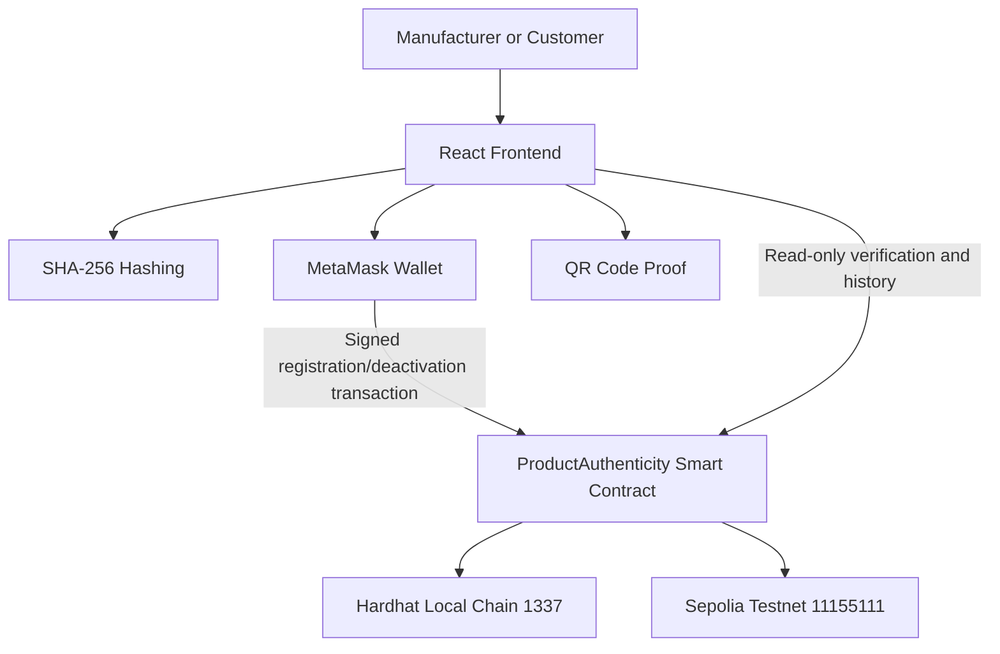
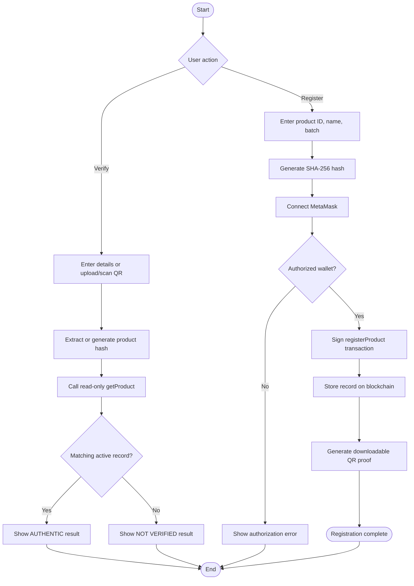

# Blockchain Lab Documentation of the Mini Project

## ProofMark: Product Authenticity Verification Using Blockchain

**Submitted by:** ______________________________  
**Roll No.:** ______________________________  
**Class / Division:** ______________________________  
**Department:** Computer Science and Engineering (AIML)  
**Academic Year:** 2026  
**Guide:** ______________________________  
**Institute:** ______________________________  

---

# Abstract

Counterfeit products create risks for consumers, manufacturers, retailers, and supply-chain participants. Traditional product databases are usually controlled by a single organization, which creates a central point of failure and makes independent verification difficult. QR codes by themselves also do not prove that the information encoded in them was registered by an authorized manufacturer.

ProofMark is a blockchain-based product authenticity registration and verification system. An authorized manufacturer enters a product identifier, product name, and manufacturing batch number. The frontend combines these values and generates a deterministic SHA-256 hash. The hash and essential product information are then stored through the `ProductAuthenticity` smart contract on an Ethereum-compatible blockchain. A customer can verify the product by entering the same details, uploading a QR code, or scanning the QR code using a camera. Verification uses a read-only blockchain lookup and does not require a wallet or gas fee.

The system demonstrates cryptographic hashing, smart-contract access control, immutable storage, wallet-based transaction signing, blockchain events, QR-based handoff, and transaction inspection. It supports Hardhat Local for fast development and Sepolia Testnet for a persistent public demonstration. The project does not claim to physically inspect a product; it verifies whether the submitted product data matches a record registered by an authorized wallet.

**Keywords:** Blockchain, Ethereum, Hardhat, Sepolia, Solidity, SHA-256, Smart Contract, MetaMask, QR Code, Product Authenticity

---

# Index

| Sr. No. | Sub Sr. No. | Particulars | Page No. |
|---:|---:|---|---:|
| 1 | — | Chapter 1: Introduction and Background | ___ |
| — | 1.1 | Introduction | ___ |
| — | 1.2 | Literature Survey | ___ |
| — | 1.3 | Problem Definition | ___ |
| — | 1.4 | Objectives | ___ |
| — | 1.5 | Proposed Solution | ___ |
| — | 1.6 | Technology / Platform Used | ___ |
| 2 | — | Chapter 2: System Design and Requirements | ___ |
| — | 2.1 | System Design / Block Diagram | ___ |
| — | 2.2 | Flow Chart | ___ |
| — | 2.3 | Software Requirements | ___ |
| — | 2.4 | Cost Estimation | ___ |
| 3 | — | Chapter 3: Implementation and Future Scope | ___ |
| — | 3.1 | Implementation Snapshots / Figures with Explanation | ___ |
| — | 3.2 | Future Directions | ___ |
| 4 | — | Conclusion | ___ |
| 5 | — | References | ___ |

---

# 1. Chapter 1: Introduction and Background

Chapter 1 establishes the background of the ProofMark project. It explains why product authenticity is an important application area, reviews the blockchain and cryptographic concepts used in related solutions, defines the problem addressed by the project, and presents the objectives, proposed approach, and technology platform.

## 1.1 Introduction

Product authenticity is important in industries such as medicines, food, cosmetics, electronics, automobile parts, luxury goods, and industrial equipment. A customer generally has to trust a label, QR code, seller, or centralized database. If the database is modified or unavailable, verification becomes difficult.

Blockchain provides a distributed and tamper-evident ledger. Once a transaction is confirmed, the record is linked to the blockchain history and can be read by authorized applications and users. ProofMark uses this property to create a public product fingerprint. The manufacturer signs a registration transaction using MetaMask, while the customer performs a free read-only verification.

The central idea of the project is to separate product information from the proof that the information was registered. Product ID, product name, and batch number are converted into a SHA-256 fingerprint. The fingerprint is stored with the manufacturer address and registration metadata. During verification, the same information produces the same fingerprint only when the submitted values are unchanged. This provides a simple and understandable demonstration of data integrity.

The system is intended for manufacturers, retailers, customers, and academic evaluators. A manufacturer receives an auditable blockchain record and a downloadable QR proof. A customer receives a simple verification experience that does not require technical knowledge of wallets or gas. An evaluator can inspect the contract, transaction receipt, events, network details, and verification result.

The project has two supported deployment modes:

- **Hardhat Local:** A local Ethereum-compatible blockchain on chain ID `1337`. It is fast and suitable for development, testing, and classroom demonstrations. Its data resets when the local node is stopped.
- **Sepolia Testnet:** A public Ethereum test network on chain ID `11155111`. It requires Sepolia test ETH but provides a persistent contract address and publicly accessible transaction history.

The application contains four primary views: Overview, Verify, Register, and Ledger. The Register view is intended for authorized manufacturers. The Verify view is public and supports manual data entry, QR upload, and camera scanning. The Ledger view displays network information, contract functions, transaction data, blockchain concepts, and FAQs.

## 1.2 Literature Survey

The literature related to ProofMark can be understood through four connected areas: blockchain-based supply-chain records, cryptographic hashing, smart-contract access control, and QR-assisted verification. Existing solutions generally address one or two of these areas, while a complete authenticity workflow must connect all of them. The survey below compares the common approaches, their benefits, their limitations, and the way they influenced the design of ProofMark.

The following survey compares the main concepts and existing approaches relevant to this project:

| Area / approach | Common method | Benefit | Limitation | Relevance to ProofMark |
|---|---|---|---|---|
| Centralized product database | A company stores product records on one server | Easy to develop and update | Single point of failure; customers must trust the database owner | ProofMark reduces dependence on one mutable database |
| Blockchain supply-chain system | Participants share records through a distributed ledger | Transparent history and tamper-evident transactions | Requires wallet management, network availability, and participant onboarding | ProofMark applies the shared-ledger idea to product registration |
| Cryptographic hashing | Product data is converted into a fixed-size digest | Detects changes efficiently without storing every comparison | A hash does not prove that the original input was truthful | ProofMark uses SHA-256 as the product fingerprint |
| Smart-contract access control | Contract modifiers restrict write functions | Enforces authorization through blockchain rules | Incorrect permissions can block valid users or allow wrong users | ProofMark authorizes manufacturer wallets before registration |
| QR-based product verification | QR stores an identifier or web link | Simple and convenient for customers | A QR code can be copied or reproduced | ProofMark links the QR to a hash checked against the contract |
| Public testnet deployment | Contract is deployed to a shared test blockchain | Persistent address and public transaction history | Depends on RPC availability and test-token faucets | Sepolia is supported for a public project demonstration |

Blockchain-based supply-chain research commonly uses a shared record of product movement and ownership. Its principal advantage is that multiple participants can inspect a common record without relying entirely on one organization's database. However, blockchain does not automatically guarantee that the original data was truthful; reliable manufacturer onboarding and physical anti-tampering measures are still required.

Hash functions such as SHA-256 convert input data into a fixed-size digital fingerprint. A deterministic hash produces the same output for the same input. The avalanche effect means that a small input change produces a substantially different output. This makes hashes useful for detecting changes to product identifiers, names, and batch numbers.

Smart contracts encode rules that are executed by the blockchain. Access-control modifiers can restrict write operations to an owner or an authorized manufacturer. ProofMark uses an owner account to authorize manufacturer addresses and protects product registration with an authorization check.

QR codes are convenient for sharing a product identifier or verification link, but a QR code alone is not proof of authenticity because it can be copied. ProofMark improves this workflow by putting a product hash in the QR URL and comparing that hash with an on-chain record.

The survey shows that ProofMark is not replacing these concepts independently; it combines them into one complete educational workflow containing hashing, wallet signing, authorization, registration, QR generation, QR upload/scanning, read-only verification, product deactivation, transaction search, and local/public testnet support.

From this review, the main design decision is to use blockchain as the trusted record layer while keeping the customer interaction simple. The manufacturer performs the state-changing action through a wallet, but the customer only performs a read-only lookup. This division reduces the technical and financial barrier for verification while preserving an auditable manufacturer registration process. It also makes the project suitable for both laboratory demonstration and future expansion into a larger supply-chain system.

## 1.3 Problem Definition

Design and implement a product authenticity system that allows an authorized manufacturer to register a tamper-evident product fingerprint on an Ethereum-compatible blockchain and allows a customer to verify the fingerprint without paying gas or connecting a wallet.

The system must address the following problems:

1. Centralized records can be modified or become unavailable.
2. A QR code alone does not prove manufacturer registration.
3. Customers need a simple verification workflow.
4. Manufacturer registration must be restricted to authorized wallets.
5. The project needs a repeatable local development setup.
6. The same application should support a public testnet demonstration.

## 1.4 Objectives

The objectives are written to cover the technical, functional, and academic outcomes of the project. The system is expected to provide a working product-authenticity workflow while also demonstrating important blockchain laboratory concepts.

### Technical objectives

1. Develop and deploy a Solidity smart contract for product registration, lookup, authorization, and deactivation.
2. Generate deterministic SHA-256 product fingerprints in the frontend using a consistent input order.
3. Store essential product data, hash, manufacturer address, timestamp, and active status on-chain.
4. Implement owner-based authorization so only approved manufacturer addresses can write records.

### Functional objectives

5. Provide public read-only verification without requiring a customer wallet or gas payment.
6. Support manual verification, QR generation, QR download, QR upload, and camera scanning.
7. Allow an authorized manufacturer to deactivate a product while preserving its historical blockchain record.
8. Display transaction hash, block number, gas used, timestamps, contract address, and network information.

### Deployment and usability objectives

9. Support Hardhat Local for repeatable development and Sepolia Testnet for persistent public demonstration.
10. Detect the active MetaMask network and select the matching contract deployment.
11. Provide a responsive interface with clear processing states, readable results, and light and dark themes.
12. Document installation, deployment, testing, limitations, and future improvements for academic evaluation.

## 1.5 Proposed Solution

The proposed solution is a layered web3 application in which the frontend, wallet, smart contract, and blockchain each perform a clearly defined responsibility. The frontend prepares and presents the data, MetaMask authorizes state-changing actions, the smart contract enforces business rules, and the blockchain stores the resulting record. This separation makes the system easier to understand, test, and extend.

ProofMark uses the following workflow:

1. The manufacturer opens the Register page and connects MetaMask.
2. The manufacturer enters product ID, product name, and batch number.
3. The frontend combines these values and computes a SHA-256 hash.
4. MetaMask signs a `registerProduct()` transaction.
5. The smart contract checks whether the sender is authorized.
6. The contract stores the product record and emits a registration event.
7. The frontend creates a QR code containing a verification URL with the product hash.
8. A customer uploads or scans the QR code, or enters product details manually.
9. The frontend calls the read-only `getProduct()` function.
10. A matching active record is displayed as `AUTHENTIC`; otherwise the result is `NOT VERIFIED`.

The application deliberately uses `getProduct()` for customer verification. The contract also contains a transaction-based `verifyProduct()` function for event-oriented demonstrations, but a public verification request should not require the customer to sign or pay gas.

The solution also handles the difference between local and public networks. During development, Hardhat Local provides fast transactions and unlimited local test ETH. For a public demonstration, Sepolia provides a persistent contract address and public transaction history. The frontend identifies the selected chain through MetaMask and reads the correct contract address from chain-specific deployment metadata.

## 1.6 Technology / Platform Used

The technology stack was selected to provide a complete blockchain laboratory implementation using widely used open-source tools. Solidity and Hardhat form the smart-contract development environment, React and CRACO provide the user interface, ethers.js connects the browser to Ethereum-compatible networks, and MetaMask provides secure user approval for transactions. Supporting libraries provide hashing, QR generation, QR decoding, camera scanning, and contract testing.

| Technology | Purpose in ProofMark |
|---|---|
| Solidity 0.8.17 | Smart-contract implementation |
| Hardhat 2.14+ | Local blockchain, compilation, deployment, and testing |
| Sepolia Testnet | Persistent public test deployment |
| React 18 | Frontend user interface |
| CRACO / Create React App | Frontend development and build configuration |
| ethers.js 5.7 | Wallet, provider, contract, and transaction interaction |
| MetaMask | Account management and transaction signing |
| SHA-256 | Product fingerprint generation |
| `qrcode.react` | QR code rendering |
| `jsQR` | QR image decoding |
| `@yudiel/react-qr-scanner` | Camera QR scanning |
| Mocha and Chai | Smart-contract testing |
| HTML5, CSS, JavaScript | Responsive presentation and interaction |
| Node.js and npm | Runtime and package management |

Solidity is used because the application logic must execute on an Ethereum-compatible blockchain. Hardhat provides compilation, local JSON-RPC execution, deployment scripts, and automated tests. React organizes the user interface into reusable pages and components. CRACO extends the Create React App build process used by the frontend. ethers.js provides provider, signer, contract, transaction, and receipt APIs.

MetaMask is used as the user-controlled wallet. It exposes the selected public address to the frontend and asks for approval before registration or deactivation. The private key is never stored in the React application. SHA-256 produces the product fingerprint, while `qrcode.react`, `jsQR`, and `@yudiel/react-qr-scanner` provide the QR workflow. Mocha and Chai support smart-contract testing. Node.js and npm provide the runtime and dependency-management tools required to install, compile, test, and run the project.

---

# 2. Chapter 2: System Design and Requirements

Chapter 2 describes how the proposed solution is organized and what is required to operate it. It presents the relationship between the user interface, MetaMask, the smart contract, and the selected blockchain network. It also explains the registration and verification flow, hardware and software requirements, and the estimated cost of developing and demonstrating the prototype.

## 2.1 System Design / Block Diagram

### High-level architecture



### Component description

**Frontend layer:** Collects product fields, produces hashes, displays status, renders QR codes, accepts QR uploads, and presents blockchain details.

**Wallet layer:** MetaMask exposes the selected account and signs write transactions locally. The private key is not sent to the application.

**Smart-contract layer:** `ProductAuthenticity.sol` stores product records and checks manufacturer authorization.

**Blockchain layer:** Hardhat Local is used for development. Sepolia is used for a persistent public test deployment.

**Deployment metadata:** `proofmark-frontend/public/deployments.json` stores a contract address per chain. The frontend selects the address according to the active MetaMask chain.

### Smart-contract data model

```text
Product {
    productId          string
    productName        string
    batchNumber        string
    productHash        bytes32
    manufacturer       address
    registrationTime   uint256
    isActive           bool
}
```

### Main contract functions

| Function | Type | Purpose |
|---|---|---|
| `authorizeManufacturer(address)` | Write | Authorizes a manufacturer; owner only |
| `removeManufacturer(address)` | Write | Removes manufacturer authorization |
| `registerProduct(...)` | Write | Stores a new product record |
| `getProduct(bytes32)` | Read | Returns a product and existence flag |
| `verifyProduct(bytes32)` | Read/transaction-capable | Returns verification information and can emit an event |
| `deactivateProduct(bytes32)` | Write | Deactivates a registered product |
| `getProductCount()` | Read | Returns the number of product hashes |
| `getProductHashAt(index)` | Read | Returns a product hash by index |

## 2.2 Flow Chart



### Network selection flow

```text
MetaMask chain ID 1337       -> deployments.json["1337"]       -> Hardhat contract
MetaMask chain ID 11155111   -> deployments.json["11155111"]   -> Sepolia contract
Other chain                   -> Unsupported network message
```

## 2.3 Software Requirements

### Hardware requirements

- Processor: Dual-core processor or better
- RAM: 4 GB minimum; 8 GB recommended
- Storage: Approximately 1 GB for dependencies and build files
- Internet: Required for npm installation, Sepolia RPC, faucets, and public testnet deployment
- Camera: Optional, required only for live QR scanning

### Software requirements

- Windows, Linux, or macOS
- Node.js 16 or later; Node.js 18 or 20 is recommended for project tooling
- npm 7 or later
- MetaMask browser extension
- Git, optional for source control
- A modern browser such as Chrome, Edge, or Firefox
- Hardhat dependencies installed under `proofmark-contracts`
- React dependencies installed under `proofmark-frontend`

### Environment requirements for Sepolia

```env
SEPOLIA_RPC_URL=https://<provider-sepolia-endpoint>
SEPOLIA_PRIVATE_KEY=0x<dedicated-test-wallet-private-key>
```

The private key must belong to a test-only wallet with Sepolia ETH. It must never be placed in frontend code, committed to source control, or used with real funds.

## 2.4 Cost Estimation

### Development cost

| Item | Local Hardhat | Sepolia Testnet |
|---|---:|---:|
| Software licenses | 0 | 0 |
| Solidity compiler | 0 | 0 |
| Hardhat | 0 | 0 |
| React and npm packages | 0 | 0 |
| MetaMask | 0 | 0 |
| Blockchain transaction fees | 0 real cost; local test ETH | Sepolia test ETH, normally free |
| RPC provider | 0 | Free tier usually sufficient for a mini-project |
| Domain/hosting | 0 for localhost | Optional; depends on hosting provider |
| Estimated academic prototype cost | **0 monetary cost** | **0 monetary cost using free tiers and faucet ETH** |

### Cost explanation

Hardhat Local is free and runs on the developer's computer. Sepolia uses test ETH that has no monetary value. A public RPC provider may offer a free plan, but usage limits apply. A production deployment would require real network gas, secure infrastructure, monitoring, domain hosting, storage, and key management. Those costs are outside the scope of this academic prototype.

### Transaction cost model

For a write transaction:

```text
Transaction cost = Gas used × Gas price
```

Registration and deactivation are write operations. Product verification through `getProduct()` is read-only and does not require gas.

---

# 3. Chapter 3: Implementation and Future Scope

Chapter 3 presents the implemented ProofMark application and explains the screenshots that should be included in the final Word report. The chapter connects each visible page or workflow to the underlying blockchain operation. It concludes with future directions that can improve scalability, privacy, security, and practical adoption.

## 3.1 Implementation Snapshots / Figures with Explanation

The final report should include screenshots captured from the running application. Suggested figures are listed below.

### Figure 1: ProofMark overview dashboard

**Insert screenshot:** Home / Overview page.  
**Explanation:** Shows the ProofMark identity, navigation, network status, wallet state, live blockchain summary, and entry points for registration and verification. The active network indicator displays Hardhat Local or Sepolia according to MetaMask.

### Figure 2: Manufacturer registration form

**Insert screenshot:** Register page before submission.  
**Explanation:** The manufacturer enters product ID, product name, and batch number. The form is connected to the selected wallet and validates the required data before hashing.

### Figure 3: Generated SHA-256 hash

**Insert screenshot:** Register page after selecting “Generate SHA-256 Hash.”  
**Explanation:** The hash is the deterministic fingerprint of the combined product fields. It is displayed before transaction submission so the manufacturer can understand what will be stored.

### Figure 4: MetaMask registration confirmation

**Insert screenshot:** MetaMask transaction confirmation window.  
**Explanation:** MetaMask shows the write transaction that will call `registerProduct()`. The private key remains inside the wallet and the application receives only the signed transaction result.

### Figure 5: Successful registration and QR proof

**Insert screenshot:** Registration success panel with transaction hash, block number, gas used, and QR code.  
**Explanation:** The transaction receipt confirms that the record was mined. The QR code contains a verifier URL with the product hash and can be downloaded for a product label or presentation.

### Figure 6: Registered product ledger

**Insert screenshot:** Manufacturer ledger with Active/Inactive status, QR preview, QR download button, and Deactivate action.  
**Explanation:** The ledger reads registered records from the contract and provides product-level management actions. QR access remains available for both active and inactive records.

### Figure 7: QR upload processing

**Insert screenshot:** Verify page while reading, decoding, or syncing a QR image.  
**Explanation:** The verification interface displays processing stages before showing the final response. This makes the QR decoding and blockchain lookup understandable to the user.

### Figure 8: Authentic verification result

**Insert screenshot:** Verify page showing `AUTHENTIC`, product details, manufacturer, timestamp, and blockchain proof.  
**Explanation:** The product hash matched an active record returned by the read-only `getProduct()` lookup.

### Figure 9: Tampered or unregistered result

**Insert screenshot:** Verify page showing `NOT VERIFIED`.  
**Explanation:** Changing one product field changes the SHA-256 hash, so the lookup does not find a matching active record.

### Figure 10: Blockchain Ledger page

**Insert screenshot:** Blockchain Details page.  
**Explanation:** Displays network information, contract address, current block, gas price, contract functions, transaction search, blockchain concepts, and FAQ content. The page works in both themes and adapts to the active network.

### Figure 11: Sepolia deployment

**Insert screenshot:** MetaMask on Sepolia and the Ledger page showing chain ID `11155111`.  
**Explanation:** Demonstrates that the same frontend can select the Sepolia contract using the deployment entry for chain `11155111`.

### Testing evidence

The following checks should be recorded in the final submitted report:

| Test | Expected result |
|---|---|
| Compile Solidity contract | Compilation succeeds |
| Run contract tests | Access control and product lifecycle tests pass |
| Register with authorized wallet | Product is stored and transaction receipt is returned |
| Register with unauthorized wallet | Transaction is rejected |
| Verify exact product details | `AUTHENTIC` |
| Change one field before verification | `NOT VERIFIED` |
| Upload a valid QR image | QR is decoded and verified |
| Deactivate a product | Product becomes inactive and is not verified as authentic |
| Switch Hardhat to Sepolia in MetaMask | Frontend changes network label and contract context |
| Search a transaction hash | Transaction details are displayed |

### Implementation explanation

The implementation is divided into a smart-contract layer, a web interface layer, and a wallet/network integration layer. This separation makes the project easier to test and explain.

The smart-contract layer is implemented in `ProductAuthenticity.sol`. The contract stores a mapping from a 32-byte product hash to a `Product` structure. It also stores an array of hashes so that the frontend can retrieve the registered product history. The constructor sets the deployer as the owner and authorizes the first manufacturer. The `authorizeManufacturer()` function permits the owner to add another address. The `registerProduct()` function is protected by the authorization modifier and validates duplicate and empty values before writing the product record.

The frontend layer is implemented with React components. `RegisterProduct.jsx` collects product information, calls the hashing utility, submits the transaction, displays the receipt, and creates the QR proof. `VerifyProduct.jsx` handles manual verification, QR upload, camera scanning, hash extraction, read-only contract lookup, and authentic or not-verified result states. `BlockchainDetails.jsx` reads network details and transaction information and presents blockchain concepts for the user. `AppShell.jsx` provides shared navigation, theme behavior, active network display, and MetaMask account switching.

The wallet integration layer uses ethers.js. A provider is used for read-only operations such as product lookup and transaction search. A signer is used only for operations that change blockchain state, such as registration and deactivation. MetaMask displays the transaction request and the user approves or rejects it. This distinction demonstrates the difference between a blockchain read operation and a blockchain write operation.

The frontend also validates the active chain. For Hardhat Local, it uses chain ID `1337` and the local deployment entry. For Sepolia, it uses chain ID `11155111` and the public deployment entry. If an unsupported network is selected, the application shows a network guidance message rather than attempting a call against an unrelated contract.

### Demonstration procedure for screenshots

The screenshots for the report should be captured in the following order:

1. Start the application with the local launcher or open the Sepolia deployment.
2. Capture the overview page with the active network visible.
3. Open Register and capture the empty registration form.
4. Enter sample values such as `SKU-001`, `Creating`, and `BATCH-2026-04`.
5. Generate the SHA-256 hash and capture the hash section.
6. Click Register on Blockchain and capture the MetaMask confirmation.
7. Confirm the transaction and capture the receipt and QR code.
8. Open the manufacturer ledger and capture the registered row with QR controls.
9. Open Verify and upload the downloaded QR image.
10. Capture the processing state and then the AUTHENTIC result.
11. Change the batch number and capture the NOT VERIFIED result.
12. Open Ledger and capture the network, contract address, and FAQ sections.

These screenshots show the complete path from product entry to blockchain registration and independent verification. They also demonstrate both the positive case and the tamper-detection case.

## 3.2 Future Directions

1. **Production network deployment:** Deploy to a supported Layer 2 or production network after security review and cost analysis.
2. **Secure QR design:** Add signed QR payloads, rotating secrets, tamper-evident labels, and duplicate-scan alerts.
3. **Supply-chain tracking:** Add manufacturer, distributor, retailer, and customer custody events.
4. **Role-based administration:** Add multiple manufacturer organizations and administrator dashboards.
5. **Batch operations:** Register or deactivate complete batches efficiently.
6. **Off-chain media storage:** Store product images and documents using IPFS or a managed storage system while keeping only content identifiers on-chain.
7. **Analytics:** Add registration volume, verification count, recall status, and geographic dashboards.
8. **Mobile application:** Provide native QR scanning and offline-friendly workflows.
9. **Security improvements:** Use audited access-control libraries, multisignature administration, hardware wallets, monitoring, and formal testing.
10. **Privacy:** Evaluate selective disclosure or zero-knowledge methods for sensitive product data.
11. **Backend indexing:** Add an event indexer for faster history queries at larger scale.
12. **Public hosting:** Host the frontend so customers can use Sepolia verification without running a local development server.
13. **Network resilience:** Support RPC failover and better handling of provider outages.
14. **Regulatory integration:** Add compliance metadata and traceability features for regulated industries.

The future development plan can be divided into short-term, medium-term, and long-term work. In the short term, the application can improve validation messages, add more automated tests, add transaction links to public explorers, and provide a downloadable verification certificate. These changes would improve the demonstration without changing the contract data model.

In the medium term, the system can introduce a backend indexer for `ProductRegistered` and `ProductDeactivated` events. An indexer would make history queries faster and would support statistics such as total registrations, active products, deactivated products, and verification activity. The frontend could then show an analytics dashboard without scanning every product one by one.

In the long term, ProofMark could become a multi-party supply-chain platform. Manufacturers could register production, distributors could record custody transfers, retailers could record receipt, and customers could verify the complete chain of custody. Each role would use a different permission level and the contract would record the responsible wallet for every event.

Future research should also examine privacy and scalability. A large company may not want product names or batch details publicly visible. A commitment-based design could store only a cryptographic commitment on-chain while revealing the original data only to authorized parties. Layer 2 networks could reduce transaction cost and improve throughput. Secure QR designs could use signed payloads, one-time identifiers, duplicate-scan monitoring, and tamper-evident physical labels.

Finally, before production use, the contract should undergo an independent security audit. Ownership should be protected by a multisignature wallet, private keys should be managed through hardware or custody infrastructure, RPC providers should have failover, and operational logs should be monitored. These measures would move the project from an academic prototype toward a dependable commercial system.

---

# 4. Conclusion

ProofMark demonstrates how blockchain, cryptographic hashing, smart contracts, wallets, and QR codes can be combined to build a product registration and verification workflow. The manufacturer generates a SHA-256 fingerprint and submits it through a wallet-signed transaction. The smart contract verifies authorization and stores the product record with its manufacturer address, timestamp, and active status. Customers can later verify the record through a free read-only lookup.

The project is suitable for laboratory learning because it provides both a local Hardhat environment and a public Sepolia deployment option. Hardhat makes development fast and repeatable, while Sepolia demonstrates persistent public blockchain behavior. The project also highlights important limitations: a blockchain verifies what an authorized account registered, but it cannot independently prove the physical origin of an item. Practical deployments must combine blockchain with secure manufacturing processes, tamper-evident packaging, reliable onboarding, and secure key management.

The implemented system satisfies the main objectives of the mini project by demonstrating immutable record storage, access control, deterministic hashing, public verification, QR-based product handoff, transaction inspection, and dual-network operation.

---

# 5. References

1. Ethereum Foundation. *Ethereum Developer Documentation*. https://ethereum.org/en/developers/docs/
2. Solidity Documentation. *Solidity Programming Language Documentation*. https://docs.soliditylang.org/
3. Hardhat Documentation. *Hardhat Ethereum Development Environment*. https://hardhat.org/docs
4. ethers.js Documentation. *ethers.js v5 Documentation*. https://docs.ethers.org/v5/
5. MetaMask Documentation. *MetaMask Developer Documentation*. https://docs.metamask.io/
6. NIST. *FIPS PUB 180-4: Secure Hash Standard (SHS)*. https://csrc.nist.gov/publications/detail/fips/180/4/final
7. Nakamoto, S. *Bitcoin: A Peer-to-Peer Electronic Cash System*. https://bitcoin.org/bitcoin.pdf
8. Wood, G. *Ethereum: A Secure Decentralised Generalised Transaction Ledger*. Ethereum Yellow Paper. https://ethereum.github.io/yellowpaper/paper.pdf
9. ProofMark project source code: `proofmark-contracts/contracts/ProductAuthenticity.sol`.
10. ProofMark project documentation: `ARCHITECTURE_AND_WORKFLOW.md`, `DEMO_RUNBOOK.md`, and `README.md`.

---

## Submission Notes

- Replace the blank title-page fields before submission.
- Add actual screenshots in the figure locations listed in Chapter 3.
- Add page numbers after exporting this Markdown document to PDF or Word.
- Include the final contract address and network used for the demonstration.
- Never include `.env`, private keys, API keys, or wallet seed phrases in the submitted report.
