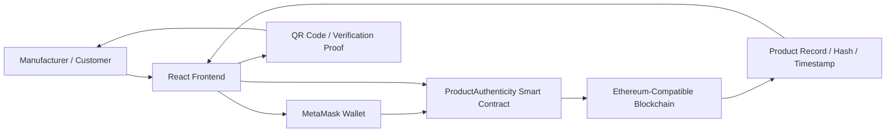
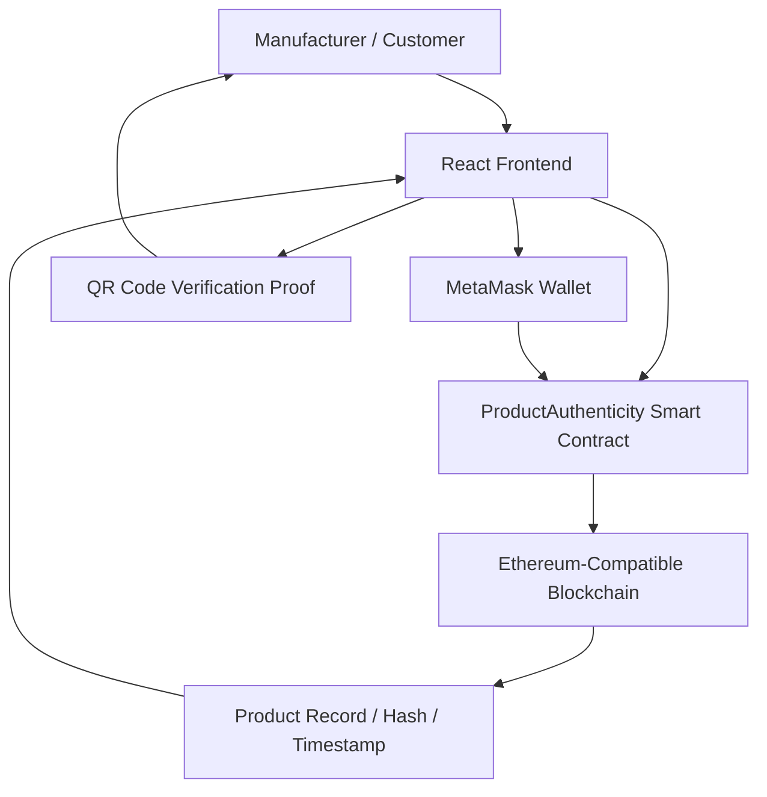
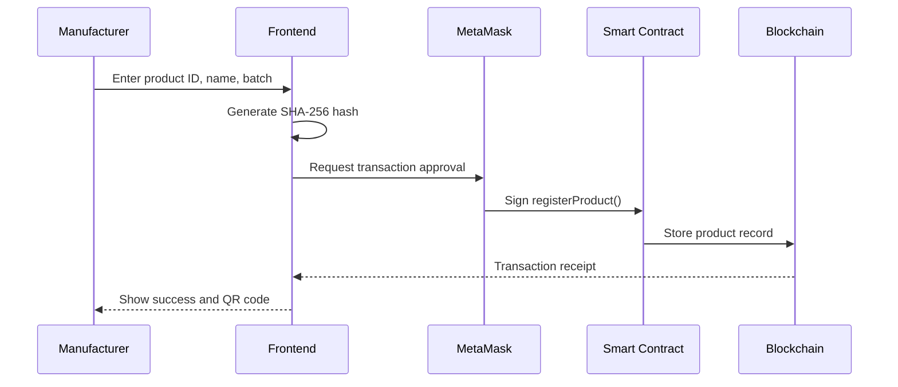
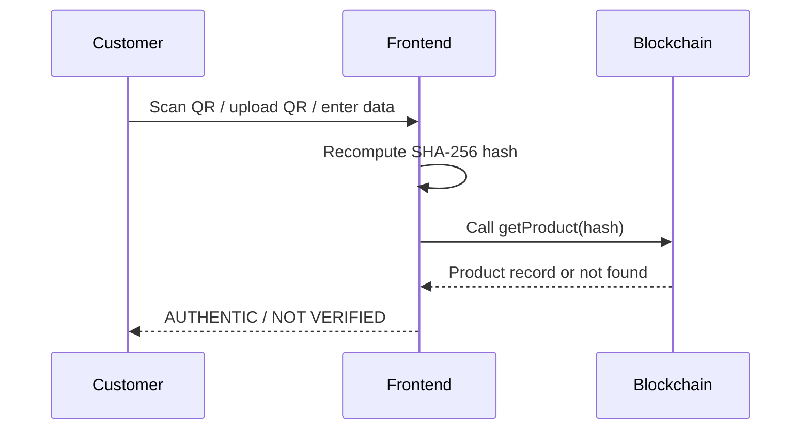

# ProofMark: Product Authenticity Verification Using Blockchain

A blockchain-based mini-project that helps manufacturers register authentic products and allows customers to verify product legitimacy with a transparent and tamper-resistant digital record.

## Overview

ProofMark is a smart-contract powered solution built to address product counterfeiting by storing product identity records on an Ethereum-compatible blockchain. Instead of relying on centralized databases or paper labels alone, the system records a unique digital fingerprint of each product and lets users verify it using a secure, hash-based process.

This project demonstrates real-world blockchain concepts such as immutability, access control, cryptographic hashing, wallet-based transactions, and verified product lookup. It is designed for academic presentation, live demo, and practical understanding of how blockchain can be applied to authenticity verification.

---

## Features

- Manufacturer authorization and secure product registration
- SHA-256 hashing for tamper-evident product identity
- Blockchain-backed product verification
- QR code generation for authentic products
- Customer-side verification via QR scan, image upload, or manual input
- Local Hardhat deployment and Sepolia public network support
- MetaMask wallet integration for transaction approvals
- Read-only verification flow without requiring gas for customer checks

---

## Problem Statement

Counterfeit products continue to affect consumer trust, safety, and business reputation across industries such as pharmaceuticals, fashion, electronics, and food. Traditional verification methods are often vulnerable because they depend on centralized records, labels, or easily duplicated QR codes.

This project addresses the question:

How can product authenticity be verified in a secure, transparent, and tamper-resistant way using blockchain technology?

---

## Proposed Solution

ProofMark uses a hybrid model of:

- Solidity smart contracts for trust and validation logic
- React frontend for user interaction
- MetaMask for wallet-based transaction signing
- Hardhat for local blockchain simulation and testing
- Sepolia for public testnet deployment
- SHA-256 hashing to check the integrity of product data

The system works as follows:

1. A manufacturer registers product information on the blockchain.
2. The frontend generates a unique hash from the product details.
3. The hash is stored together with product metadata on-chain.
4. A customer verifies authenticity by regenerating the same hash and checking the blockchain record.
5. If the hash matches an active product record, the product is marked authentic.

---

## Technology Stack

| Layer | Technology | Role |
|------|------------|------|
| Blockchain | Solidity | Smart contract logic |
| Local Development | Hardhat | Local blockchain, testing, deployment |
| Public Testnet | Sepolia | Public blockchain deployment |
| Frontend | React | Application UI |
| Web3 Integration | ethers.js | Blockchain communication |
| Wallet | MetaMask | Transaction signing and network connection |
| Hashing | SHA-256 | Product fingerprint generation |
| Build Tool | CRACO / React App | Frontend configuration and build |
| Testing | Mocha + Chai | Smart contract validation |

---

## System Architecture

### High-Level Architecture



### Layered Design

- Frontend layer: handles product input, hashing, QR generation, verification, and result display.
- Wallet layer: MetaMask signs write transactions and provides the active account.
- Smart contract layer: enforces authorization rules and stores product data on-chain.
- Blockchain layer: maintains immutable product records and transaction history.
- Verification layer: customers compare a newly generated hash with the blockchain record without paying gas.

### Block Diagram



### Registration Flow



### Verification Flow



### Main Functional Flow

- Manufacturer enters product details in the frontend.
- Product data is converted into a SHA-256 hash.
- The hash is sent to the Solidity contract for registration.
- The on-chain record is stored with access-control checks.
- Customer verifies the same product using QR scan or manual input.
- The system compares the newly generated hash with the blockchain record.

---

## Project Structure

```text
Product-Authenticity-Blockchain/
├── README.md
├── docs/
│   ├── screenshots/
│   ├── TEAM_PRESENTATION_SCRIPT.md
│   └── ...
├── ideateefi-backend-node/
├── ideateefi-frontend-react/
├── ideateefi-postgres-database/
├── ideateefi-smartcontract-solidty/
├── start-demo.ps1
├── package.json
├── .gitignore
├── .env.example
└── ...
```

---

## Quick Start

### Prerequisites

- Node.js v16+
- npm v7+
- MetaMask browser extension
- Git

### Run the project

From the project root:

```powershell
powershell -ExecutionPolicy Bypass -File .\start-demo.ps1
```

This launcher can:

- start a local Hardhat node
- deploy the contract
- fund and authorize the demo manufacturer wallet
- update the frontend environment values
- launch the frontend app

### Network modes

```powershell
powershell -ExecutionPolicy Bypass -File .\start-demo.ps1 -Network Both
powershell -ExecutionPolicy Bypass -File .\start-demo.ps1 -Network Local
powershell -ExecutionPolicy Bypass -File .\start-demo.ps1 -Network Sepolia
```

Use MetaMask to switch between:

- Hardhat Local: Chain ID `1337`
- Sepolia: Chain ID `11155111`

---

## How It Works

### Manufacturer Registration

1. Connect MetaMask wallet.
2. Go to the Register Product page.
3. Enter product details such as product ID, name, and batch number.
4. Generate the SHA-256 hash.
5. Submit the blockchain transaction.
6. Confirm in MetaMask.
7. Product gets permanently stored on-chain.

### Customer Verification

1. Open the Verify Product page.
2. Upload the QR image, scan with camera, or enter product details manually.
3. The app recalculates the hash.
4. It checks the stored blockchain record.
5. The app displays:
   - Authentic
   - Not Verified

---

## Screenshots

Add the relevant screenshots into the `docs/screenshots/` folder and update the file names below with your actual images.

### 1. Home / Landing Screen


Caption: Home page of the ProofMark application showing the main product authenticity concept and navigation.

### 2. Product Registration Page


Caption: Manufacturer dashboard where product information is entered and registered on the blockchain.

### 3. MetaMask Transaction Confirmation


Caption: MetaMask transaction approval window for securely signing the product registration request.

### 4. QR Code Generation


Caption: Generated QR code after successful product registration, which can be used for customer verification.

### 5. Product Verification Page


Caption: Customer verification screen for scanning or uploading a QR code to validate the product.

### 6. Authentic Result


Caption: Successful verification result where the product hash matches the blockchain record and is marked authentic.

### 7. Fake / Not Verified Result


Caption: Verification failure scenario showing a product that is missing or not registered on the blockchain.

> Tip: Keep screenshots clear and uncluttered. For a project demo, use 1–2 screenshots per major stage to keep the README clean and professional.

---

## Smart Contract Highlights

The smart contract includes core features such as:

- authorized manufacturer access
- product registration with hash verification
- product lookup without wallet interaction
- deactivation support for unsafe or recalled products
- immutable on-chain record storage

---

## Key Blockchain Concepts Demonstrated

- Immutability
- Hashing
- Access control
- Smart contracts
- Wallet-based transactions
- Distributed verification

---

## Limitations

- Blockchain verifies the registered product record, not the physical item itself.
- Product integrity still depends on the trustworthiness of product data entered by the manufacturer.
- Public chain transactions require network fees and wallet connectivity.
- If the manufacturer private key is compromised, fake products could be registered.

---

## Future Scope

- Supply chain tracking integration
- Mobile app support
- Multi-signature approval workflow
- NFT-based product identity
- Cross-chain deployment
- Smart recall and product deactivation dashboard

---

## Documentation

- Architecture and workflow
- Demo runbook
- Viva quick guide
- Startup guide

---

## Team

- Harshal
- Hardik
- Jeet
- Kavya

---

## Project Status

Status: Completed and demo-ready

This project is suitable for final-year academic demonstration, viva presentation, and blockchain-based product authenticity proof-of-concept work.

---

## License

This project is intended for educational and academic demonstration purposes.

